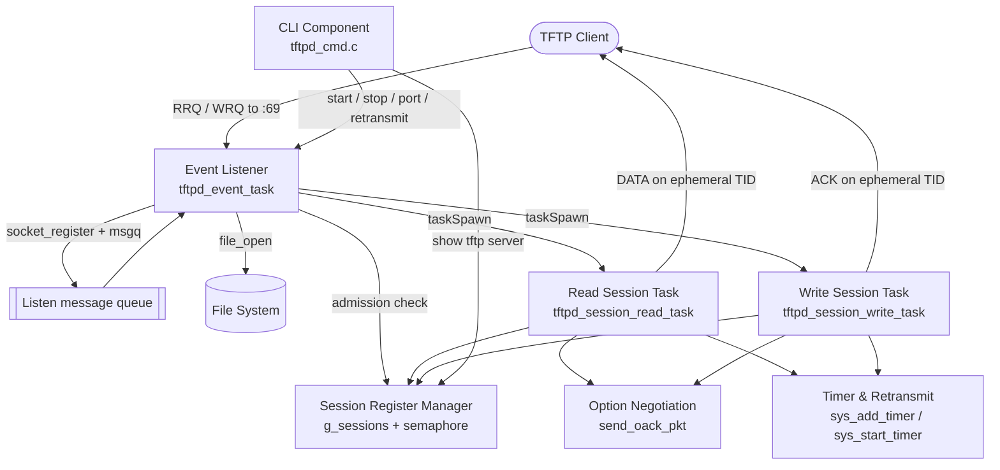
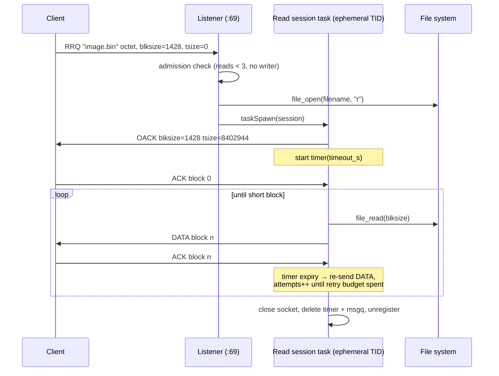
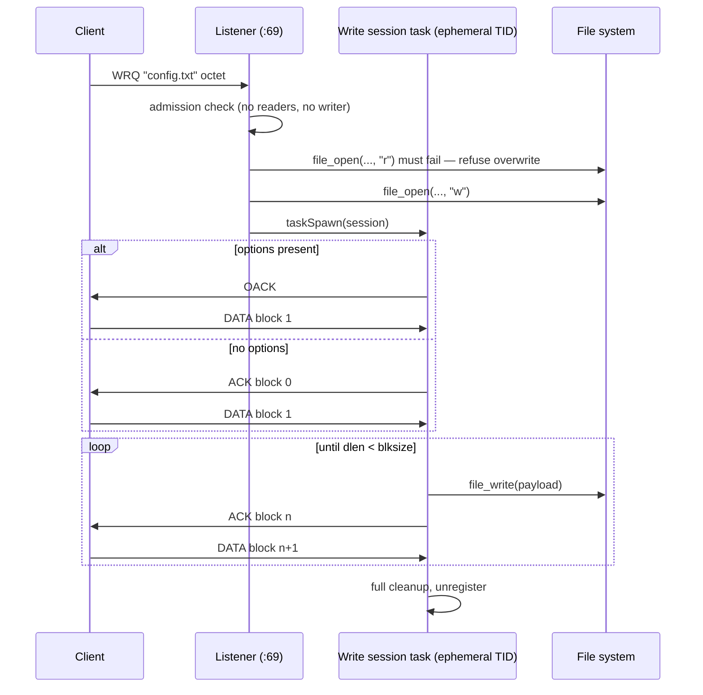
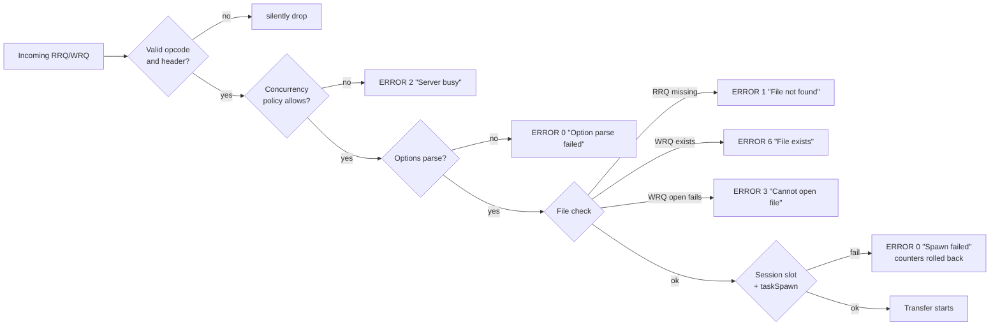
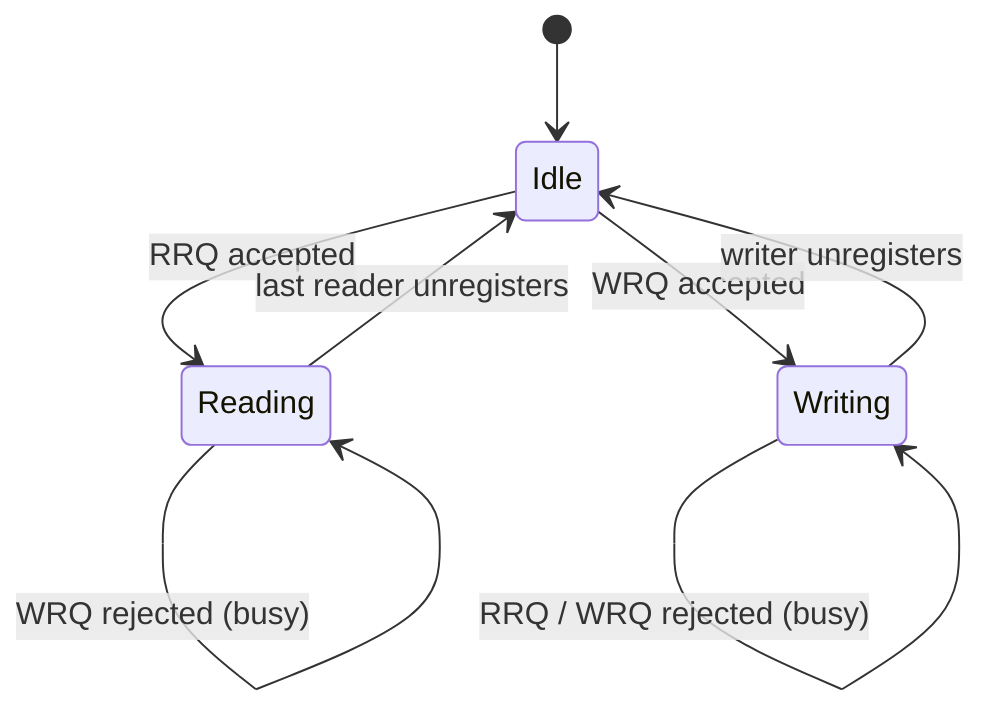

# tftpd — Embedded TFTP Server Module for VxWorks

A compact, task-per-session TFTP server written in C for the switch/router firmware platform. It implements the base protocol from **RFC 1350** plus the option extensions from **RFC 2347 / 2348 / 2349**, so clients can negotiate block size, retransmission timeout and transfer size through an OACK exchange before any data moves.

The module is self-contained: it registers its own CLI commands, its own version record and its own `show running-config` hook, and it can be enabled or disabled at runtime without restarting anything else.


---

## Table of contents

- [Features](#features)
- [Architecture](#architecture)
- [Repository layout](#repository-layout)
- [Protocol flows](#protocol-flows)
- [Concurrency model](#concurrency-model)
- [Packet formats](#packet-formats)
- [Option negotiation](#option-negotiation)
- [CLI reference](#cli-reference)
- [Defaults and limits](#defaults-and-limits)
- [Platform interfaces](#platform-interfaces)
- [Integration](#integration)
- [Error codes](#error-codes)
- [Design document](#design-document)

---

## Features

- **Read (RRQ) and write (WRQ) transfers** over UDP, one dedicated task and ephemeral TID per session.
- **OACK negotiation** for `blksize` (8–65464), `timeout` (1–255 s) and `tsize`, with server-side clamping of out-of-range requests.
- **Up to 3 concurrent readers**, or **exactly one writer** — readers and writers are mutually exclusive, so a firmware image can never be read while it is being overwritten.
- **Timer-driven retransmission** with a configurable retry budget, driven by a per-session loop timer rather than blocking reads.
- **TID validation** on every received datagram; packets from an unexpected source get error code 5 and are otherwise ignored.
- **Duplicate handling** — duplicate DATA gets a repeated ACK, duplicate/stale ACK triggers an immediate re-send of the current block (Sorcerer's Apprentice mitigation).
- **CLI integration**: enable/disable, port, retransmit tuning, live session listing, and non-default settings echoed into `show running-config`.
- **Deterministic cleanup** — socket, message queue, timer, file handle, option strings and the session slot are released on every exit path.

---

## Architecture

<p align="center">
  
</p>

A single **event task** owns port 69 and does nothing but admission control: it parses the request header, checks the concurrency policy, opens the file, allocates the session, and hands it to a freshly spawned session task. All per-transfer work — OACK, DATA/ACK lock-step, retries, cleanup — happens inside that session task on its own ephemeral socket, so a slow or dead client can never stall the listener.



### Component responsibilities

| Component | Source | Responsibility |
|---|---|---|
| Event Listener | `tftpd_task.c`, `tftpd_handle_listen_event()` | Owns port 69, parses RRQ/WRQ, enforces the concurrency policy, spawns sessions |
| Session Task Manager | `tftpd_session_read_task()`, `tftpd_session_write_task()` | Runs the transfer state machine on a private socket + msgq + timer |
| Option Negotiation Handler | `process_tftp_options()`, `send_oack_pkt()`, `parse_options_area()` | Validates and clamps options, builds the OACK |
| Timer & Retransmission Manager | `sys_add_timer` / `sys_start_timer` usage in the session tasks | Drives timeouts, re-sends the last packet, terminates on retry exhaustion |
| Session Register Manager | `session_register()`, `session_unregister()`, `tftpd_show_sessions()` | Fixed-size table under a semaphore; also the source for the CLI session list |
| CLI Interface | `tftpd_cmd.c`, `tftp_showrunning()` | Command registration, parameter validation, status output |

---

## Repository layout

```
.
├── tftpd.h          # Types, opcodes, packet overlays, tunables, prototypes
├── tftpd.c          # Listener handler, session tasks, options, packet helpers, session table
├── tftpd_task.c     # Lifecycle (start/stop), globals, listen socket, event loop, status output
├── tftpd_cmd.c      # CLI command tree registration and handlers
└── docs/
    ├── architecture.svg
    ├── packet-formats.svg
    └── Design_of_tftpd_version_2.pdf
```

| File | Roughly what lives there |
|---|---|
| `tftpd.c` | `tftpd_init`, `tftpd_handle_listen_event`, both session tasks, `process_tftp_options`, `pack_data` / `pack_ack`, `send_error_pkt`, `send_oack_pkt`, session table |
| `tftpd_task.c` | `tftpd_start` / `tftpd_stop`, `create_listen_socket`, `tftpd_event_task`, `show_tftp_server`, config setters |
| `tftpd_cmd.c` | `tftp server enable`, `tftp server port`, `tftp server retransmit`, `show tftp server` |

---

## Protocol flows

### Read request with option negotiation



### Write request



### Rejection paths



Every rejection path after the counters were incremented falls through the `rollback:` label, so a failed spawn or a full session table can never leak a permanent "server busy" state.

---

## Concurrency model

The policy is enforced in one critical section guarded by `g_sessions_sem`, before any expensive work happens:

| Incoming | Active readers | Active writer | Result |
|---|---|---|---|
| RRQ | `< 3` | no | accepted, `g_active_reads++` |
| RRQ | `= 3` | no | ERROR 2 — busy |
| RRQ | any | yes | ERROR 2 — busy |
| WRQ | `0` | no | accepted, `g_write_active = 1` |
| WRQ | `> 0` | no | ERROR 2 — busy |
| WRQ | any | yes | ERROR 2 — busy |



Multiple readers may open the *same* file concurrently — that is explicitly allowed. The counters are decremented in exactly one place for the success path (`session_unregister()`) and one for the failure path (`rollback:`).

---

## Packet formats

<p align="center">
  
</p>

Packets are accessed through packed overlay structs rather than manual offset arithmetic:

```c
typedef struct tftp_data {
    uint16_t opcode;
    uint16_t block;
    uint8_t  data[0];
} __attribute__((packed)) tftp_data_t;
```

---

## Option negotiation

| Option | RFC | Accepted range | Behaviour when out of range |
|---|---|---|---|
| `blksize` | 2348 | 8 – 65464 | Clamped to the nearest bound and echoed in the OACK |
| `timeout` | 2349 | 1 – 255 seconds | Reset to the default timeout |
| `tsize` | 2349 | — | RRQ: server reports the real file length. WRQ: client's value is echoed back |

Additionally, `timeout × retry` must not exceed **255**. If the negotiated pair violates that, both fall back to their defaults. Only options the client actually asked for appear in the OACK, as RFC 2347 requires. If the client sends no options at all, the server skips the OACK entirely and uses the classic RFC 1350 opening (DATA 1 for a read, ACK 0 for a write).

---

## CLI reference

| Command | Mode | Description |
|---|---|---|
| `tftp server enable` | global config | Starts the listener, event task and session table |
| `no tftp server enable` | global config | Stops the server and releases all resources |
| `tftp server port <1-65535>` | global config | Sets the listening UDP port |
| `no tftp server port` | global config | Reverts to port 69 |
| `tftp server retransmit <timeout> <retry>` | global config | Sets retransmission timeout (1–255 s) and retry count (1–6) |
| `no tftp server retransmit` | global config | Reverts to the built-in defaults |
| `show tftp server` | privileged / global config | Shows configuration and every active session |

A port change takes effect the next time the server is enabled, so re-run `no tftp server enable` / `tftp server enable` after changing it.

Example output:

```
=== TFTP SERVER STATUS ===
TFTP Enable     : Yes
TFTP Port       : 69
Timeout         : 5 sec
Retry           : 10

--- Active TFTP Sessions ---
  [0] RRQ    192.168.1.44:51230   filename=image.bin  blksize=1428, timeout=5, retry=10
  [1] RRQ    192.168.1.77:40118   filename=image.bin  blksize=512, timeout=5, retry=10
----------------------------
```

Non-default settings are written back through `tftp_showrunning()`, so they survive in `show running-config`:

```
tftp server enable
tftp server port 6969
tftp server retransmit 3 3
```

---

## Defaults and limits

| Constant | Value | Meaning |
|---|---|---|
| `TFTPD_DEFAULT_PORT` | 69 | Listening UDP port |
| `TFTPD_DEFAULT_BLKSIZE` | 512 | Block size when `blksize` is not negotiated |
| `TFTPD_MAX_BLKSIZE` | 65464 | Upper clamp for `blksize` |
| `TFTPD_MIN_BLKSIZE` | 8 | Lower clamp for `blksize` |
| `TFTPD_DEFAULT_TIMEOUT_S` | 5 | Retransmission timeout in seconds |
| `TFTPD_DEFAULT_RETRY` | 10 | Retry budget per packet |
| `TFTPD_MAX_TIMEOUT_PRODUCT` | 255 | Ceiling on `timeout × retry` |
| `TFTPD_MAX_SESSIONS` | 4 | Session table size |
| `TFTPD_MAX_CONCURRENT_READS` | 3 | Simultaneous readers |
| `TFTPD_FILENAME_MAXLEN` | 128 | Longest accepted filename |
| `TFTPD_SESSION_STACK` | 8 KB | Stack per session task |
| `TFTPD_TASK_PRIO` | 128 | Priority of listener and session tasks |
| `MAX_MSQ_MESSAGES` | 64 | Depth of each message queue |
| `PACKET_BUFFER_SIZE` | 1500 | Listener receive buffer |

> The CLI accepts `retry` in the range 1–6 while the compiled-in default is 10; adjust `TFTPD_DEFAULT_RETRY` if the two need to agree.

---

## Platform interfaces

The module is written against the platform abstraction layer rather than POSIX directly:

| Area | Functions used |
|---|---|
| Sockets | `so_socket`, `so_bind`, `so_recvfrom`, `so_sendto`, `so_setsockopt`, `so_close`, `socket_register` |
| Tasks | `taskSpawn`, `taskDelete` |
| Message queues | `sys_msgq_create`, `sys_msgq_send`, `sys_msgq_receive`, `sys_msgq_delete` |
| Semaphores | `sys_sm_create`, `sys_sm_p`, `sys_sm_v` |
| Timers | `sys_add_timer`, `sys_start_timer`, `sys_stop_timer`, `sys_delete_timer` |
| File I/O | `file_open`, `file_read`, `file_write`, `file_close`, `getfilelen` |
| Memory | `sys_mem_malloc`, `sys_mem_free` |
| CLI / system | `registercmd`, `register_subcmd_tab`, `getparameter`, `subcmd`, `vty_printf`, `Print`, `syslog`, `register_module_version`, `interface_set_showrunning_service` |

Sockets are event-driven: `socket_register()` binds a descriptor to a message queue, so both socket arrivals and timer expiries reach a session task through the same `sys_msgq_receive()` call. There is no polling loop anywhere in the module.

---

## Integration

Call the initializer once during system bring-up:

```c
void tftpd_init(void);   /* registers version, show-running hook, and CLI commands */
```

`tftpd_init()` performs three things and returns immediately — nothing listens until the operator enables the server:

1. `register_module_version()` with `MODULE_TYPE_TFTPD` and `TFTPD_VERSION`
2. `interface_set_showrunning_service()` to hook `tftp_showrunning()`
3. `tftpd_register_cmds()` to publish the CLI tree

Add the four source files to the module's build list; `tftpd.h` pulls in the platform headers it needs (`ip/socket.h`, `taskLib.h`, `semLib.h`, `libfile/file_sys.h`, `libsys/*`).

---

## Error codes

| Code | Name | Emitted when |
|---|---|---|
| 0 | `TFTP_ERR_UNDEF` | Allocation failure, option parse failure, task spawn failure |
| 1 | `TFTP_ERR_NOTFOUND` | RRQ for a file that cannot be opened for reading |
| 2 | `TFTP_ERR_ACCESS` | Concurrency policy rejects the request ("Server busy") |
| 3 | `TFTP_ERR_DISKFULL` | WRQ target cannot be created, or `file_write()` fails mid-transfer |
| 4 | `TFTP_ERR_ILLEGAL` | Reserved for malformed operations |
| 5 | `TFTP_ERR_UNKNOWN_TID` | Datagram arrives from an address/port other than the session peer |
| 6 | `TFTP_ERR_EXISTS` | WRQ for a filename that already exists |
| 7 | `TFTP_ERR_NOUSER` | Reserved |

Session lifecycle events are logged through `syslog()` — completions at `LOG_INFO`, aborts and retry exhaustion at `LOG_WARNING`, disk and client errors at `LOG_ERR` — each tagged with the filename and the client `address:port`.

---

## Design document

The full specification, including functional and performance requirements, pseudocode for every procedure, and detailed interface definitions, is in [`docs/Design_of_tftpd_version_2.pdf`](docs/Design_of_tftpd_version_2.pdf).

**Referenced standards**

- RFC 1350 — The TFTP Protocol (Revision 2)
- RFC 2347 — TFTP Option Extension
- RFC 2348 — TFTP Blocksize Option
- RFC 2349 — TFTP Timeout Interval and Transfer Size Options

---

## Author

**Afiat Khan Tahsin** — BDCOM Online Technologies
